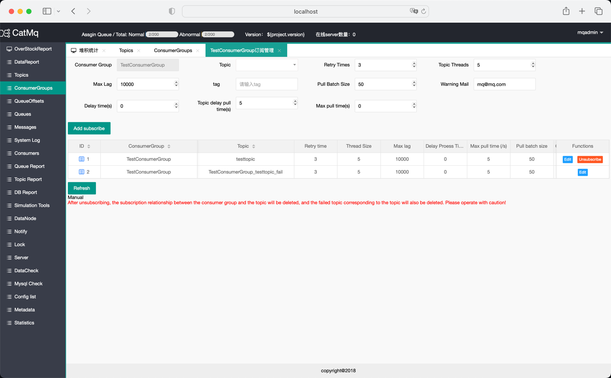

<h1 align="center">CatMQ</h1>

[English](./README.md) / [简体中文](./README_CN.md)

轻量级, 拥有完善的可视化消息管理后代的分布式消息队列系统

## 特性

- **高性能**：CatMQ使用了最新的技术，使得它能够快速地处理大量的消息。
- **易于使用**：CatMQ的API设计得非常直观，使得开发者可以快速地上手。
- **分布式**：CatMQ支持分布式系统，可以轻松地扩展到多个服务器。
- **完善的Web管理后台**：CatMQ具有一个功能完善的Web管理后台，允许用户在页面上操作，调整生产者，消费者，队列，offset等信息。
- **顺序消息**：CatMQ支持FIFO模型的顺序消息，保证消息在一个ConsumerGroup中按照顺序消费。
- **延时消息**：为满足延迟消费的场景，CatMQ支持设定消息的延迟消费时间。
- **消费者和队列的负载均衡**：CatMQ支持动态调整消费者和消息队列的数量，以应对消费堆积或消费者宕机的情况。
- **多消费者组订阅**：一个队列可以被多个消费者组同时订阅，消费者组之间的消费互不影响。
- **消费进度调整**：CatMQ支持实时动态调整消费者组的消费进度，调整后的消费进度实时生效。
- **消息的存储和定时清理**：CatMQ使用数据库持久化消息，并设定消息过期时间，过期的消息会自动被清除。

## 最新动态
- [x] 完成基础的类似Kafka 的设计开发
- [x] 适配画面开发
- [x] 添加定时消费线程清理很久没有消费的信息
- [x] 添加系统配置自动检查线程
- [x] 写文档，发布网站，让更多的人更加容易了解项目
- [ ] 适配JDK21，希望可以同时支持jdk8和jdk21

## 安装
[快速启动](https://iambiglee.github.io/docs/example/quickstart/)  
[QuickStart for English user](https://iambiglee.github.io/en/docs/example/quickstart/)

## 文档
项目的详细文档位置[CatMQ](https://iambiglee.github.io/docs/example/introduce/)

## 贡献
CatMQ 项目欢迎大家参与进来维护，大家可以通过提Issue,或者是提交 RP 的方式参与进来

## 许可证
Apache License, Version 2.0 Copyright (C) Apache Software Foundation.[Apache License](https://www.apache.org/licenses/LICENSE-2.0.html)